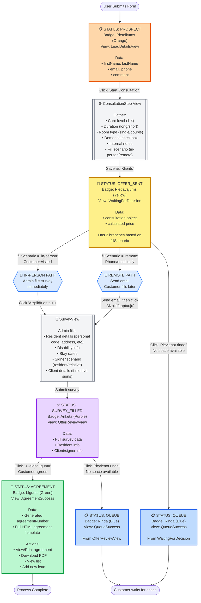

# Adoro Client Intake - Status Flow Diagram



## Status Summary

| Status | Badge Text | Color | View | Description |
|--------|-----------|-------|------|-------------|
| **prospect** | Pieteikums | 🟠 Orange | LeadDetailsView | Initial contact form submitted |
| **consultation** | Konsultācija | 🟡 Yellow | WaitingForDecision | Consultation completed (offer may be sent via email) |
| **survey_filled** | Anketa | 🟣 Purple | OfferReviewView | Survey/questionnaire filled |
| **agreement** | Līgums | 🟢 Green | AgreementSuccess | Agreement created |
| **queue** | Rindā | 🔵 Blue | QueueSuccess | Added to waiting queue |

## Key Decision Points

### 1. Fill Scenario Selection (at Consultation)
- **In-Person**: Customer visited facility → Admin fills survey immediately
- **Remote**: Phone/email contact → Send email, wait for customer to fill (or admin fills later)

### 2. After Survey Filled
- **Customer Agrees** → Create Agreement (generates agreement number)
- **No Space Available** → Add to Queue

### 3. Alternative Path
- **Directly from Offer** → Can add to queue without filling survey if clearly no space

## Data Flow

```
prospect
  └─ firstName, lastName, email, phone, comment

consultation
  └─ All prospect data +
     └─ consultation {
          careLevel, duration, roomType,
          hasDementia, notes, fillScenario, price
        }
     └─ emailSent (boolean, if offer email was sent)

survey_filled
  └─ All offer_sent data +
     └─ survey {
          Resident: personal code, birth date, address, gender, disability, stay dates
          Signer scenario: resident | relative
          Client (if relative): client details, relationship
        }

agreement
  └─ All survey_filled data +
     └─ agreementNumber (e.g., "2025-001")

queue
  └─ All consultation data
     └─ Waiting for available space
```

## Notes

- **Email Integration**: Email sending is tracked with `emailSent`, `emailSentDate`, `emailSentTime`
- **Facility**: Hardcoded to "Adoro Šampēteris" (single facility mode)
- **Pricing**: Automatically calculated based on care level + duration + room type + dementia
